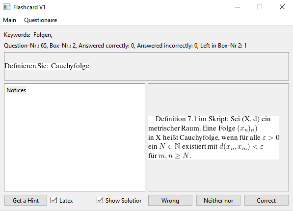
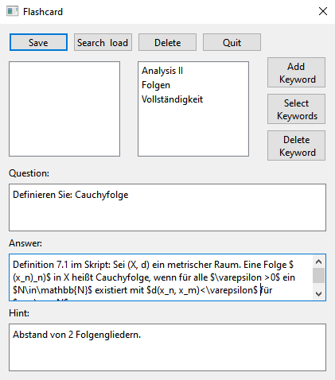

# Flashcard
**Achtung: Um LaTeX zu verwenden wird eine separate LaTeX installation benötigt. Zudem sollte beim ersten Start der Pfad zur latex.exe Datei in den Einstellungen angegeben und gespeichert werden! Zudem sollte mit dem Timeout gespielt werden, wenn keine LaTeX ausgabe erzeugt wird.**

Flashcards ist ein Karteikartenprogramm, das LaTeX unterstützt. Es gibt fünf Karteikartenkästchen. Zu Beginn des Lernens sind alle Karteikarten in Kasten Nr. 1. Wird eine Frage korrekt beantwortet,
kommt die Karte in den nächst höheren Kasten, wird die Frage falsch beantwortet, kommt sie in den nächst kleineren Kasten und sollte die Karte lieber in dem aktuellen Kasten bleiben, kann "weder noch" gewählt werden.

Es gibt 4 Lernmodi:

|                           | Fragen aus allen Kästen | Fragen aus Kasten Nr. i |
| ---------------------     | :-------------------:   | :-------------------:   |
| **Jede Frage nur 1 Mal**  | a                       | b                       |
| **Fragen beliebig oft**   | c                       | d                       |

Bei Fragen aus allen Kästen (a und c) werden Karten aus dem 1. Kasten 5 Mal so häufig gestellt, wie Fragen aus dem 5. Kasten. Fragen aus dem 2. Kasten werden 4 Mal so häufig gestellt, wie Fragen aus dem 5. Kasten, etc. Dadurch werden Fragen, die noch nicht sicher beantwortet werden können, häufiger gelernt als Fragen, die schon gut gelernt wurden.

Sollen der Reihe nach (aber zufällig gemisch) alle Fragen aus mehreren Kästen nacheinander ein einziges Mal gelernt werden (Fall b), sollte mit Kasten Nr. 5 begonnen werden. Dann sollte mit Kasten Nr. 4 fortgefahren werden, anschlißend ist Kasten Nr. 3 an der Reihe, etc. Denn wenn mit Kasten 1 begonnen wird, und eine Frage korrekt beantwortet wird, kommt die Frage in Kasten 2. Wird anschlißend Kasten 2 gelernt, kommt die gleiche Frage mit einer höheren Wahrscheinlichkeit in Kasten 3 (weil die Frage erst vor Kurzem beantwortet wurde) etc. Wird umgekehrt eine Frage aus bspw. Kasten 4 falsch beantwortet, wird sie erneut gelernt, wenn Kasten 3 gelernt wird. So könnnen falsche Fragen direkt erneut abgefragt werden.

Sollen alle Fragen nur ein einziges Mal gelernt werden, bietet sich Modus a an.

## Installation und Ausführung
Das Programm wurde auf Windows 10 geschrieben und getestet. Zur Installation wird der Ordner Flashcard_V1_0 heruntergeladen und auf dem PC gespeichert. Danach kann das Programm mit einem Doppelklick auf Flashcard.exe gestartet werden.

Der Quellcode befindet sich im Ordner SourceCode.

## Screenshots

Eine Frage wird gelernt:

Eine Frage wird bearbeitet:

Copyright (C) 2024 Michael